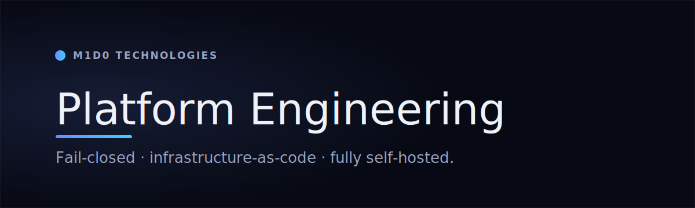

  

  
  
  

# Platform Engineering & Automation

> How **M1D0 Technologies** — the boutique digital-transformation practice that builds and operates for the Dahhan Enterprises group — designs, ships, and runs the group's ventures on one hardened, observable, fully self‑hosted platform.

This is a **capability overview**, not a codebase. It describes *how we operate* — the engineering philosophy and the production systems behind the portfolio — without exposing source, hostnames, or operational detail.

## Engineering philosophy

We build **fail‑closed, infrastructure‑as‑code, and review‑gated by default.** Every environment‑facing decision — DNS, access, tunnels, repository policy, host baseline — is written as code and reviewed before it takes effect. Production is dark until explicitly approved: a new venture serves a maintenance response and stays gated until an owner authorizes go‑live, so nothing reaches the public internet by accident. Images and configuration are immutable and versioned; releases promote **staging → verify → production** by shipping the *same* artifact; destructive or credential‑bearing actions require deliberate human friction. The safe state is the default state, drift shows up in a diff, and every change is recoverable.

## Capabilities at a glance

- **Shared platform architecture** — one enforced standard (Next.js 16 RSC monorepos, standalone containers, a shared CMS) so a fix in one venture becomes a pattern for all.
- **Deployment & edge** — Docker + Caddy behind a Cloudflare Tunnel and edge; no exposed origin ports; maintenance‑gated by default.
- **Infrastructure as code** — OpenTofu for Cloudflare and GitHub with remote, locked state; Ansible for host baseline and second‑region readiness.
- **CI/CD & release engineering** — self‑hosted runners, promotion of the same digest from staging to production, health‑gated rollback, and supply‑chain scanning, SBOM, and signing.
- **Observability & reliability** — metrics, logs, traces, uptime, and error tracking in‑house, with dead‑man's‑switch canaries and watchdogs on load‑bearing services.
- **Backup & disaster recovery** — restore‑*tested* snapshots and database backups, plus an off‑box critical‑secret set with round‑trip verification.
- **Security posture** — zero‑trust access, a WAF paired with a self‑hosted decision engine, deny‑by‑default RBAC, secret scanning, encryption at rest, `p=reject` email hardening, and a per‑request CSP nonce.
- **AI & automation platform** — a self‑hosted, loopback‑only agent hub for internal engineering, and n8n business‑process automation (form → CMS → system of record) with retries, backoff, and monitoring.
- **Quality & accessibility** — Playwright E2E and axe accessibility checks, with strict type, lint, and coverage gates before any deploy.

→ Full detail on every capability: **[docs/architecture.md](./docs/architecture.md)**

## Toolbox

  
  
  
  
  
  
  
  

---

## Work with us

Need this level of platform engineering for your own product?

- 🌐 **[m1d0.com](https://www.m1d0.com)** &nbsp;·&nbsp; ✉️ **contact@m1d0.com**

By **M1D0 Technologies** · part of the Dahhan Enterprises group. Capability overview only — no source, hostnames, or operational detail. © 2026 Dahhan Enterprises LLC — M1D0 Technologies, Dahhan Industries, Miss Dantella and affiliated brands. All rights reserved.
